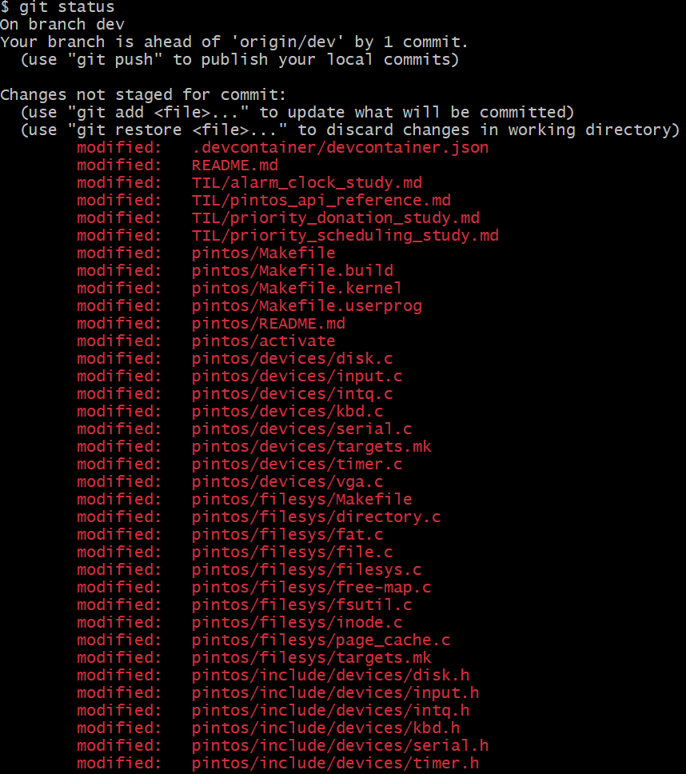
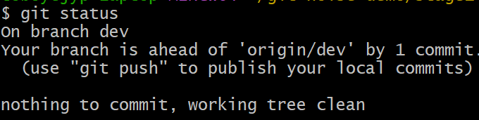
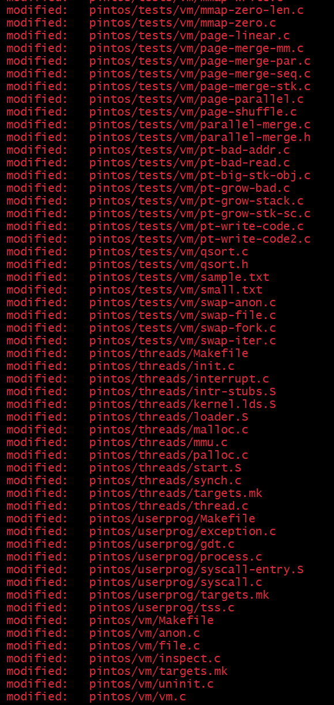
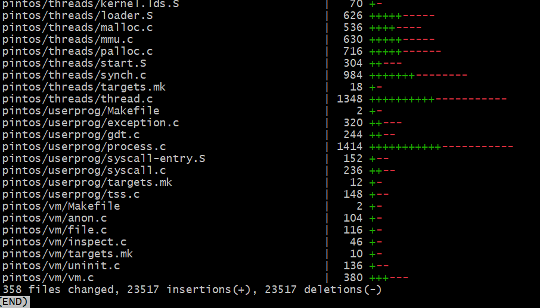

# PR Merge 중 발생한 CRLF/LF 노이즈 트러블슈팅

> 같은 코드인데 PR diff에 수백~수천 라인이 "전부 변경됨"으로 떠서 머지가 사실상 불가능했던 사건.
> 원인은 두 가지 — **줄 끝(CRLF↔LF)** + **파일 권한(실행비트)** — 이 동시에 작용하고 있었다.



> ↑ 코드는 한 줄도 안 건드렸는데 리포 전체가 빨간 modified. 이게 우리가 PR 화면에서 마주한 그림이다.

---

## 1. 사건의 시작 — devcontainer 에서 시작한 리포를 Windows 에서 열기

### 타임라인

| 날짜 | 커밋 | 누가 | 무슨 일 |
|---|---|---|---|
| 2026-04-23 | `154a0f7` | jypark | **dev container (Linux) 안에서 `git init`** 으로 프로젝트 시작 |
| 2026-04-24 | `127b8f6` | IMGyuGo | **같은 폴더를 Windows 측에서 열어보고** "all modified" 마주함 → 즉시 `Normalize line endings to LF` 로 1차 fix 시도 |
| 2026-04-24 ~ 2026-05-01 | (여러 PR) | 팀 전체 | PR 머지마다 같은 노이즈 재발 — 1차 정규화로는 봉인 안 됨 |
| 2026-05-01 | `bc3d912` | jypark | `.gitattributes` 추가 (본격 fix, 아래 §5 참조) |

### 무슨 일이 일어났나 — 기술 분석

**dev container = Linux 환경**. 그 안에서 `git init` + `git add` 하면 인덱스에 다음과 같이 박힌다:
- 줄 끝: **LF** 그대로 (Linux 기본, 변환 없음)
- 모드: 실제 파일 권한 그대로 (이 리포는 mount 환경 영향으로 대부분 `100755` 로 들어감 — 자세한 건 §3 원인 B)

**같은 폴더를 Windows 측에서 열기** (WSL 마운트 `\\wsl.localhost\<distro>\workspaces\...` 또는 Windows 호스트 마운트 경유):

작업 트리 파일 자체는 한 바이트도 안 변했다. 그러나 Windows 위의 git (특히 git bash) 이 그 폴더에서 작동할 때, **Windows 기본 git 설정** 이 적용된다:

1. **`core.autocrlf=true`** (Windows git installer 기본값)
   → "working tree 는 CRLF 여야 한다" 고 기대
   → 실제 파일은 LF
   → 모든 텍스트 파일이 modified 로 잡힘
2. **`core.filemode`** 자동 감지
   → 인덱스의 `100755` vs 작업 트리에서 보이는 권한 차이
   → mode change 로 또 modified

**결과**: 작업 트리는 그대로인데 `git status` 가 리포 전체를 빨간 modified 로 도배 → 위 hero 이미지 같은 화면.

### 정상 측 — devcontainer 안에서는 항상 깨끗했다

같은 리포, 같은 커밋. 다만 **dev container (Linux) 안에서 본 `git status`**:



> `nothing to commit, working tree clean` — 한 줄 modified 도 없다.
>
> 이게 우리가 처음 리포를 만들었을 때 본 모습이고, 매일 dev container 안에서 작업하는 우리에겐 **이쪽이 "정상" 으로 보였다**. 그래서 Windows 측 팀원이 "all modified 가 떠요" 라고 했을 때 처음엔 재현이 안 돼서 진단에 시간이 걸렸다.

**같은 코드, 같은 인덱스, 다른 OS — 두 화면 사이의 차이가 정확히 이 트러블슈팅의 본체다.**

### 핵심 한 줄

> **"같은 git 리포를 두 OS 에서 다루기 시작한 순간"** 이 모든 노이즈의 출발점이다.
>
> dev container (Linux) 와 Windows native git 의 기본값 차이 — 줄 끝 자동 변환 + 권한 비트 — 가 표면화된 것이고, 이건 **누군가의 실수가 아니라 환경의 충돌**이다.

### 사이드바 — 팀 동료의 "소문자 브랜치 컨벤션도 CRLF 때문 아니냐?" 질문 검증

이 트러블슈팅을 정리하던 중 팀 동료가 "GitHub 브랜치 이름을 모두 소문자 컨벤션으로 통일하는 것도 CRLF/LF 이슈 때문인 거 아니냐?" 고 물었다. **검증 결과: 기술적으로 우리 CRLF/filemode 이슈와는 별개**다.

| 축 | 우리 이슈 (CRLF / filemode) | 소문자 브랜치 컨벤션 (case sensitivity) |
|---|---|---|
| 무엇이 다른가 | 파일 **내용**의 줄 끝 바이트 + 파일 **권한 비트** | git 레퍼런스 **이름**의 대소문자 |
| 어디서 충돌하나 | autocrlf 자동 변환 / chmod 비트 | NTFS·HFS+ 등 **case-insensitive 파일시스템** |
| 표면화 시점 | `git status` / `git diff` | `git checkout`, branch push, `.git/refs/heads/<name>` 충돌 |
| 해결책 | `.gitattributes` + `core.filemode=false` | 브랜치 이름 소문자 통일 |

소문자 브랜치 컨벤션의 진짜 이유는 **case-insensitive 파일시스템에서의 ref 충돌**이다. git 은 브랜치를 `.git/refs/heads/<branch-name>` 파일로 저장하는데, NTFS (Windows) 와 macOS HFS+ 는 기본적으로 대소문자를 구분 안 한다 → `feature/Login` 과 `feature/login` 이 같은 파일로 취급되어 충돌. 이걸 막으려고 소문자로 통일하는 것.

→ **CRLF 와 같은 "OS 간 git 충돌" 패밀리에 속하긴 하지만, 메커니즘은 완전히 다르다.** 이 트러블슈팅 doc 의 fix (`.gitattributes` + `core.filemode`) 와는 무관하므로 별도 정책으로 다룬다. 소문자 브랜치 컨벤션 자체는 좋은 관행이다 — 단지 그 정당성이 CRLF 가 아니라 case sensitivity 에서 온다.

---

## 2. 무엇이 보였나 (PR 단계의 2차 증상)

§1 의 초기 사건 이후, **PR 머지 단계에서도 같은 노이즈가 다른 형태로 재발**했다:

- 머지 PR 을 열면 변경하지도 않은 파일이 통째로 modified 로 잡힘
- `git diff <PR>` 가 **수만 라인**의 +/- 로 도배됨 → 의미 있는 코드 변경이 그 안에 묻혀 보이지 않음
- 같은 리포를 두 사람이 각각 클론했을 때 `git status` 결과가 다름 → 리뷰가 불가능
- 한 쪽 OS 에서 봤을 땐 깨끗한데 다른 OS 에서 보면 "all modified" — 머지 가능 여부가 OS 에 따라 달라지는 비정상 상태

이 시점에서 IMGyuGo 의 1차 정규화 (`127b8f6`) 만으로는 불충분하다는 게 분명해졌다. 새 파일이 Windows 측에서 add 되면 다시 CRLF 가 인덱스에 박혔고, 권한 비트 노이즈는 아예 손도 안 댄 상태였기 때문이다.

---

## 3. 두 원인을 분리해서 진단

### 원인 A — CRLF/LF (줄 끝 문자)

- **Unix/Linux/macOS**: 줄 끝이 `\n` (LF, 1바이트)
- **Windows**: 줄 끝이 `\r\n` (CRLF, 2바이트)
- git 의 `core.autocrlf` 설정 + `.gitattributes` 부재 → OS 별로 작업 트리에 다른 줄 끝이 풀리거나, 누군가 CRLF 상태로 add → 인덱스에 CRLF 가 박혀 들어감
- 결과: 다른 OS 에서 풀면 "모든 라인이 다르다" 로 보임

### 원인 B — 파일 권한 (실행비트)

- Unix는 파일에 실행비트(`+x`)가 있음. git은 이걸 100644 / 100755 로 추적
- WSL2 가 Windows 마운트(`/mnt/c/...`)를 노출할 때 파일을 일괄 777 로 보여줌
- 누군가 그 마운트에서 add 하면 인덱스에 100755 로 박힘 (이 리포는 **630/635 파일이 100755 로 커밋**되어 있음 — 비정상)
- 다른 환경에서 100644 로 체크아웃되면 모드 차이로 modified 표시

---

## 4. 재현 (시연 캡쳐)

> 샌드박스: `/tmp/git-noise-demo/{stage1..stage4}` — 각각 fresh clone.
> 모든 스테이지는 먼저 `.gitattributes` 를 제거해 봉인을 해제한 상태에서 시작한다.

### Stage 1 — baseline (노이즈 트리거 없음)

`.gitattributes` 만 제거. 이 시점엔 작업 트리가 그대로라 깨끗:

```
$ git status
On branch dev
Your branch is ahead of 'origin/dev' by 1 commit.
nothing to commit, working tree clean
```

### Stage 2 — CRLF 노이즈만 ⭐ (Windows git bash 실제 캡쳐)

작업 트리의 텍스트 파일들에 `sed -i 's/$/\r/'` 로 CRLF 주입 (Windows 측에서 편집·저장된 상황을 재현). **아래 캡쳐 3장은 실제 Windows git bash 에서 찍은 것** — 사건 당시 팀이 본 화면 그대로다.

#### 캡쳐 1 — `git status` 상단: "all modified" 의 시각적 충격


> 보다시피 코드 한 줄 안 건드렸는데 `.devcontainer/devcontainer.json`, `README.md`, `TIL/*.md`, `pintos/Makefile*`, `pintos/devices/*.c`, `pintos/filesys/*.c` ... 가 모두 빨간색 modified.
> PR 리뷰어 입장에선 어디서부터 봐야 할지 막막한 상태.

#### 캡쳐 2 — `git status` 하단: 끝나지 않는 modified 목록



> 화면 전체가 modified. `pintos/tests/vm/*`, `pintos/threads/*`, `pintos/userprog/*`, `pintos/vm/*` — 사실상 리포 전체.

#### 캡쳐 3 — `git diff --stat` 의 결정적 증거



> **마지막 줄이 핵심 증거**:
> ```
> 358 files changed, 23517 insertions(+), 23517 deletions(-)
> ```
> **insertions 와 deletions 가 정확히 같은 23517** — 라인 단위로 코드가 변경된 게 아니라, **모든 라인이 통째로 삭제 후 재삽입**되고 있다는 뜻. 라인 내용은 동일하고 라인 종결자(`\n` ↔ `\r\n`)만 다를 때 정확히 이 패턴이 나온다.
>
> 또한 우측의 막대 그래프(`+++++-----`)도 +/- 가 균등 — 일반적인 코드 변경이라면 비대칭이어야 정상.

#### 보조 증거 — `cat -A` 로 줄 끝 문자 가시화

(시연 환경에서 추가 확인. `$` = LF, `^M$` = CRLF):

```
$ git diff pintos/userprog/syscall.c | grep '^-[^-]' | head -3 | cat -A
-#include "userprog/syscall.h"$
-#include <stdio.h>$
-#include <syscall-nr.h>$

$ git diff pintos/userprog/syscall.c | grep '^+[^+]' | head -3 | cat -A
+#include "userprog/syscall.h"^M$
+#include <stdio.h>^M$
+#include <syscall-nr.h>^M$
```

→ `-` 라인(HEAD blob)은 `$` (LF) 로 끝, `+` 라인(작업 트리)은 `^M$` (CRLF) 로 끝.
**라인 내용은 한 글자도 안 다르다.**

#### 보조 증거 — hex dump 로 바이트 레벨 비교

```
[작업 트리, 첫 줄 끝 4 바이트]
22 0d 0a 23   →   "  \r \n  #     ← CRLF (\r\n)

[HEAD blob, 첫 줄 끝 3 바이트]
22 0a 23      →   "  \n  #         ← LF (\n)
```

→ 차이는 **`\r` 1바이트**. 그것 하나가 358 개 파일 × 평균 65 라인 ≈ **23,000 + 라인의 가짜 변경**으로 증폭됐다.

### Stage 3 — 파일 권한 노이즈만

`core.filemode=true` + 모든 트래킹 파일에 `chmod -x` (Windows native git 클론처럼 실행비트가 빠진 상황을 재현):

```
$ git ls-files -s | awk '{print $1}' | sort | uniq -c
      5 100644
    630 100755          ← 리포에 100755 로 커밋된 파일 630개

$ git status | head
Changes not staged for commit:
	modified:   .devcontainer/Dockerfile
	modified:   .gitignore
	modified:   pintos/Makefile
	... (총 630개) ...

modified file count: 630
```

**diff 출력은 내용 변경이 0 — 모드 비트만 다르다:**

```
$ git diff pintos/userprog/syscall.c
diff --git a/pintos/userprog/syscall.c b/pintos/userprog/syscall.c
old mode 100755
new mode 100644
```

### Stage 4 — 두 노이즈 동시

```
modified file count: 635
```

```
$ git diff pintos/userprog/syscall.c | head -7 | cat -A
diff --git a/pintos/userprog/syscall.c b/pintos/userprog/syscall.c$
old mode 100755$
new mode 100644$
index d9fd618..3448ca7$
--- a/pintos/userprog/syscall.c$
+++ b/pintos/userprog/syscall.c$
@@ -1,118 +1,118 @@$
```

→ **모드 변경 + 라인 종결자 변경** 두 노이즈가 한 diff 안에서 합쳐서 나타남.

### 각 봉인 한 개씩 풀었을 때 (효과 검증)

| 상태 | modified 개수 |
|---|---|
| 두 노이즈 모두 활성 | **635** |
| `core.filemode=false` 만 끔 | 351 (CRLF 만 남음) |
| `.gitattributes` 복원 + `git add --renormalize .` | ~0 (배경의 진짜 차이만 남음) |

→ **두 봉인 다 필요하다**. 어느 쪽도 없으면 절반의 노이즈가 살아남는다.

---

## 5. 적용된 fix

### A. `.gitattributes` 추가 (커밋 `bc3d912`)

```gitattributes
* text=auto eol=lf

*.c          text eol=lf
*.h          text eol=lf
... (확장자별 명시) ...

*.bin        binary
*.dsk        binary
... (바이너리 명시) ...
```

핵심:
- `text=auto eol=lf` — 텍스트로 감지된 모든 파일은 **저장소에는 LF**, OS 별 작업 트리에서만 필요 시 변환
- 확장자별 `text eol=lf` — auto 감지 실패 대비
- 바이너리 명시 — diff/merge/줄 끝 변환 모두 비활성

### B. `core.filemode=false` (각자 .git/config)

```bash
git config core.filemode false
```

- 작업 트리의 실행비트 차이를 git이 무시
- WSL2 마운트, macOS, Windows 사이를 오갈 때 mode-change 노이즈 차단
- **주의**: 이건 .git/config 에 들어가므로 *각자 한 번씩* 설정해야 함. 리포에 박을 수는 없음

### 적용 순서 (새로 합류한 팀원)

```bash
git pull                              # .gitattributes 받기
git config core.filemode false        # 권한 차이 무시
git rm --cached -r . && git reset --hard   # 작업 트리 재정렬
```

---

## 6. 발표용 요약 슬라이드

> **사건 한 줄**: "PR diff 가 23,517 라인으로 폭발해서 코드 리뷰가 불가능했다."
>
> **결정적 증거 한 장** (`git diff --stat`):
> ```
> 358 files changed, 23517 insertions(+), 23517 deletions(-)
> ```
> insertions 와 deletions 가 정확히 같다 = 코드가 바뀐 게 아니라 줄 끝 문자만 바뀌었다.
>
> **원인**: CRLF/LF 차이 (358 파일, 47k 라인 노이즈) + 파일 권한 차이 (630 파일 mode-only 노이즈)
>
> **해결**:
> 1. `.gitattributes` 로 줄 끝을 LF로 강제 (저장소에 박힘, 모두에게 적용)
> 2. `core.filemode=false` 로 실행비트 차이 무시 (각자 한 번 설정)
>
> **검증**: 어느 한 쪽만으로는 노이즈의 절반이 살아남음 → **둘 다 필요**

---

## 7. 부록 — 시연 직접 돌려보기

샌드박스 클론은 `/tmp/git-noise-demo/{stage1-baseline, stage2-crlf, stage3-filemode, stage4-both}` 에 살아 있다. `git status`, `git diff`, `cat -A` 등으로 직접 확인 가능. 정리는:

```bash
rm -rf /tmp/git-noise-demo
```

스테이지를 처음부터 다시 만들고 싶다면 이 문서의 stage 2~4 명령을 그대로 실행. 각 스테이지는 독립된 fresh clone 이라 서로 영향 없음.
